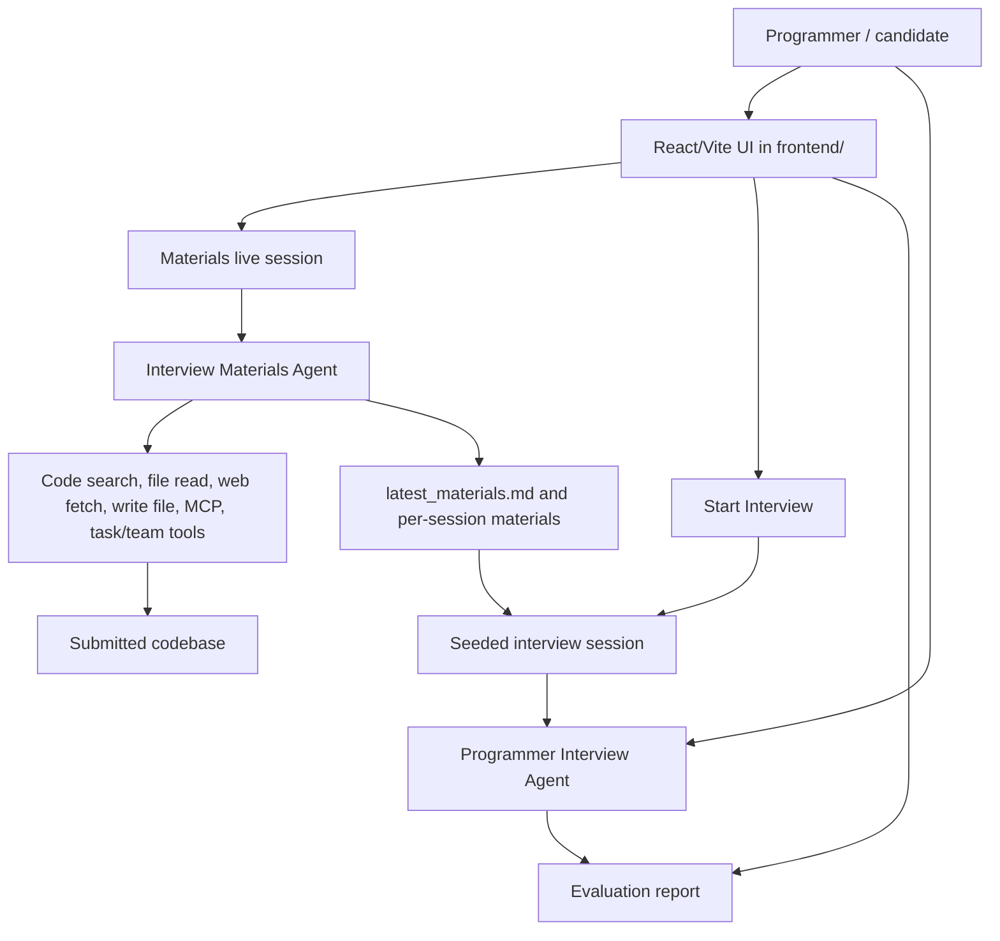

# Scribe Engine

[English](README.md) | [中文](README.zh-CN.md)

Scribe Engine is a Rust-based programmer interview agent service. It helps an interviewer or hiring workflow turn a candidate's submitted code into architecture-focused interview material, then uses that material to run a live technical interview and produce an evaluation report.

The project is intentionally documented as code: each tracked directory has a README so a new developer, or a fresh AI coding session, can understand the system without re-reading every source file first.

## What It Does

Scribe Engine coordinates two agents behind a local web UI:

- **Interview Materials Agent** analyzes the submitted codebase, uses repository tools, and writes interview material to `.transcripts/interview_materials/latest_materials.md`.
- **Programmer Interview Agent** starts from those generated materials, asks the programmer one question at a time, tracks the interview phase, and produces a final Markdown evaluation report.

The runtime supports multiple sessions, session switching, persisted UI snapshots, streamed live events, trace files for tool activity, and cancelling an active agent turn.



## Run Locally

1. Copy `.env.example` to `.env` and set at least `LLM_API_KEY`, plus `LLM_BASE_URL` and `LLM_MODEL` when you are not using the defaults.
2. Start the web runtime:

```bash
cargo run -- serve --host 127.0.0.1 --port 3000
```

3. Open `http://127.0.0.1:3000`.
4. Ask the materials agent to analyze the codebase and generate interview materials.
5. Click **Start Interview** when materials exist.
6. Click **Finish Interview** to request and persist the final evaluation report.

Useful CLI commands:

```bash
cargo run -- tools
cargo run -- tool-call --name glob_search --input '{"pattern":"src/**/*.rs"}'
```

## Runtime Model

- `src/main.rs` builds the CLI, loads `.env`, registers built-in and MCP tools, and starts the Axum web server.
- `src/ask.rs` builds two runtimes: a tool-enabled materials runtime and a tool-free interviewer runtime.
- `src/web.rs` owns workflow state, session selection, live events, cancellation, interview start/finish, and report persistence.
- `src/runtime.rs` runs the model/tool loop, streams runtime events, checks cancellation, and triggers context compaction.
- `src/llm/` contains the OpenAI-compatible client, persisted conversation sessions, prompt cache, and usage accounting.
- `src/tools/` contains model-facing tools used by the materials agent.
- `frontend/` is the React/Vite browser UI that calls REST endpoints and listens to SSE updates.
- `src-tauri/` packages the React UI with the Rust backend for the desktop app.
- `config/` contains optional MCP server configuration.

## Directory Guide

- [`config/`](config/README.md): MCP configuration and how plugin tools enter the registry.
- [`src/`](src/README.md): Rust backend module boundaries and control flow.
- [`src/llm/`](src/llm/README.md): model calls, sessions, prompt cache, audit logs, and compaction settings.
- [`src/tools/`](src/tools/README.md): built-in tools, MCP tools, and task/team orchestration.
- [`frontend/`](frontend/): React/Vite web UI source. Build output is served from `frontend/dist`.
- [`src-tauri/`](src-tauri/): Tauri desktop shell for the React UI and local backend.

Ignored runtime directories such as `.transcripts/`, `.team/`, `logs/`, `.venv/`, and `target/` are not documented as source directories because they hold local state, generated output, or dependencies.

## Session And Artifact Layout

By default, conversation and workflow artifacts live under the transcript directory from the LLM context compaction config. Current code defaults that directory to `.transcripts`.

Important generated artifacts:

- `.transcripts/interview_materials/sessions/{session_id}.json`
- `.transcripts/interview_materials/materials/{session_id}.md`
- `.transcripts/interview_materials/latest_materials.md`
- `.transcripts/programmer_interview/sessions/{session_id}.json`
- `.transcripts/programmer_interview/reports/{session_id}.md`
- `.transcripts/programmer_interview/latest_evaluation_report.md`
- `.transcripts/workflow_snapshot.json`

These files are runtime state and are ignored by git.

## Development Notes

- The materials agent should ground architecture claims in code, configuration, or observed repository structure.
- The interviewer agent should not inspect the codebase directly; it only receives generated materials and candidate answers.
- Context compaction preserves recent messages, summarizes older context, and keeps tool-call boundaries valid.
- Tool output is treated as untrusted evidence in prompts; source files can contain prompt-injection text.
