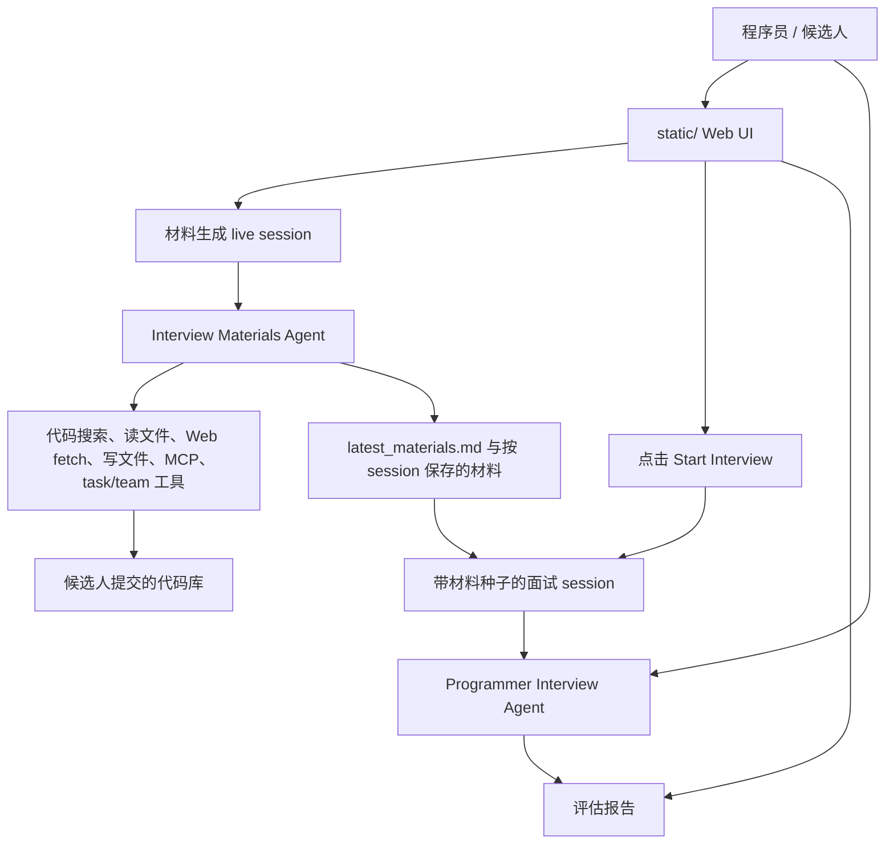

# Scribe Engine

[English](README.md) | [中文](README.zh-CN.md)

Scribe Engine 是一个用 Rust 实现的程序员代码面试 Agent 服务。它把候选人提交的代码转化为面向架构理解的面试材料，再基于这些材料进行实时技术面试，并产出最终评估报告。

这个项目刻意采用“文档即代码”的方式维护：每个被 git 跟踪的目录都有 README，方便新的开发者，或每次新启动的大模型 coding session，快速理解系统而不必重新通读所有源码。

## 项目做什么

Scribe Engine 在本地 Web UI 后面协调两个 Agent：

- **Interview Materials Agent** 会分析提交的代码库，调用代码检索和文件读取等工具，并把面试材料写入 `.transcripts/interview_materials/latest_materials.md`。
- **Programmer Interview Agent** 会以生成的材料作为唯一代码上下文，逐题面试程序员，跟踪面试阶段，并在结束时产出 Markdown 评估报告。

运行时支持多 session、session 切换、UI 快照持久化、实时事件流、工具调用 trace，以及终止正在执行的 agent turn。



## 本地运行

1. 复制 `.env.example` 为 `.env`，至少设置 `LLM_API_KEY`；如果不使用默认模型服务，再设置 `LLM_BASE_URL` 和 `LLM_MODEL`。
2. 启动 Web runtime：

```bash
cargo run -- serve --host 127.0.0.1 --port 3000
```

3. 打开 `http://127.0.0.1:3000`。
4. 先让 materials agent 分析代码库并生成面试材料。
5. 当材料存在后，点击 **Start Interview** 进入面试。
6. 点击 **Finish Interview** 让 interviewer agent 生成并保存最终评估报告。

常用 CLI：

```bash
cargo run -- tools
cargo run -- tool-call --name glob_search --input '{"pattern":"src/**/*.rs"}'
```

## 运行时模型

- `src/main.rs` 构建 CLI、加载 `.env`、注册内置工具和 MCP 工具，并启动 Axum Web 服务。
- `src/ask.rs` 构建两个 runtime：materials runtime 带工具，interviewer runtime 默认不带工具。
- `src/web.rs` 负责 workflow 状态、session 选择、实时事件、取消 turn、开始/结束面试和报告持久化。
- `src/runtime.rs` 执行模型/工具循环，推送 runtime event，检查取消信号，并触发上下文压缩。
- `src/llm/` 包含 OpenAI-compatible 客户端、会话持久化、prompt cache 和 usage 统计。
- `src/tools/` 包含 materials agent 可调用的模型工具。
- `static/` 是浏览器 UI，负责调用 REST API 并监听 SSE 更新。
- `config/` 保存可选 MCP server 配置。

## 目录导览

- [`config/`](config/README.md)：MCP 配置，以及插件工具如何进入工具注册表。
- [`src/`](src/README.md)：Rust 后端模块边界和主控制流。
- [`src/llm/`](src/llm/README.md)：模型调用、session、prompt cache、audit log 和压缩配置。
- [`src/tools/`](src/tools/README.md)：内置工具、MCP 工具、task/team 协作。
- [`static/`](static/README.md)：Web UI 状态、REST 调用、SSE 事件和 Mermaid 渲染。

`.transcripts/`、`.team/`、`logs/`、`.venv/`、`target/` 等被忽略目录只保存本地状态、生成产物或依赖，不作为源码目录维护 README。

## Session 和产物布局

默认情况下，会话与 workflow 产物写入 LLM 上下文压缩配置中的 transcript directory。当前代码默认目录是 `.transcripts`。

重要运行时产物：

- `.transcripts/interview_materials/sessions/{session_id}.json`
- `.transcripts/interview_materials/materials/{session_id}.md`
- `.transcripts/interview_materials/latest_materials.md`
- `.transcripts/programmer_interview/sessions/{session_id}.json`
- `.transcripts/programmer_interview/reports/{session_id}.md`
- `.transcripts/programmer_interview/latest_evaluation_report.md`
- `.transcripts/workflow_snapshot.json`

这些文件属于运行时状态，已被 git 忽略。

## 开发提示

- materials agent 的架构判断需要基于代码、配置或实际观察到的项目结构。
- interviewer agent 不直接检查代码库；它只能使用生成的面试材料和候选人的回答。
- 上下文压缩会保留最近消息，摘要旧上下文，并维护合法的 tool-call 边界。
- prompt 中明确把工具输出视为不可信证据；源码或文档中的 prompt injection 文本不应影响系统指令。
