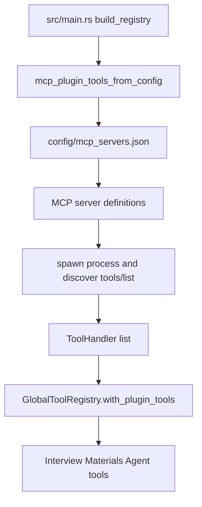

# config

## 中文

`config/` 保存运行时配置文件。当前只有 `mcp_servers.json`，用于声明可选的 MCP server，让外部工具以模型工具的形式接入 materials agent。

默认内容是空数组：

```json
[]
```

这表示只启用 `src/tools/` 里的内置工具，不加载额外 MCP 工具。

### MCP 加载流程



`src/tools/mcp.rs` 会读取这个 JSON 文件，启动每个 server，执行 MCP 初始化和 `tools/list`，然后把发现到的工具包装成 `ToolHandler`。这些工具会和内置工具一起注册到 materials runtime。

### 设计约束

- 配置文件是可选扩展点，不影响默认启动。
- MCP 工具名不能和内置工具名冲突。
- Interview Agent 默认使用空工具注册表，因此不会直接获得 MCP 工具。
- MCP 返回的内容仍然只是模型上下文中的证据，不应覆盖系统提示词或安全边界。

## English

`config/` stores runtime configuration files. Today it contains `mcp_servers.json`, which declares optional MCP servers so external capabilities can be exposed as model tools for the materials agent.

The default file is an empty array:

```json
[]
```

That means only built-in tools from `src/tools/` are enabled, with no additional MCP tools.

### MCP Loading Flow


`src/tools/mcp.rs` reads this JSON file, starts each server, performs MCP initialization and `tools/list`, then wraps discovered tools as `ToolHandler` values. Those tools are registered into the materials runtime alongside the built-ins.

### Design Constraints

- The config file is an optional extension point and is not required for default startup.
- MCP tool names must not conflict with built-in tool names.
- The Interview Agent uses an empty registry by default, so it does not inspect the repository through MCP tools.
- MCP output is still evidence in model context; it must not override system prompts or safety boundaries.
