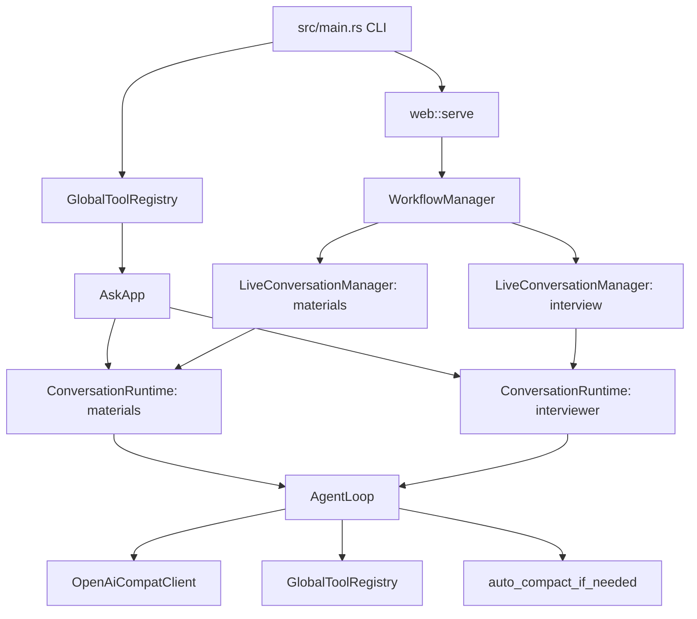

# src

## 中文

`src/` 是 Scribe Engine 的 Rust 后端。它把命令行入口、Web workflow、双 agent runtime、LLM 客户端、工具系统和上下文压缩连接在一起。

### 模块职责

- `main.rs`：加载 `.env`，解析 CLI，构建工具注册表，启动 Web 服务或执行工具命令。
- `cli.rs`：定义 `tools`、`tool-call`、`serve` 三个命令。
- `agents.rs`：定义两类 agent 及其 system prompt。
- `ask.rs`：创建 materials runtime 和 interviewer runtime，负责 session 创建、加载和路径管理。
- `web.rs`：Axum API、workflow 状态、live conversation、SSE、session 切换、开始/结束面试和报告保存。
- `runtime.rs`：模型/工具循环，包含 tool call 执行、runtime event、取消信号和自动上下文压缩。
- `compact.rs`：估算上下文大小、摘要旧消息、修复 tool message 边界，并备份压缩前 transcript。
- `config.rs`：从环境变量读取 LLM、GitHub、上下文压缩等配置。
- `llm/`：OpenAI-compatible 客户端、session、prompt cache、usage 统计。
- `tools/`：materials agent 可用的模型工具。

### 后端组件关系

### 关键运行流程

1. `cargo run -- serve` 进入 `main.rs`，构建内置工具和 MCP 工具。
2. `AskApp::from_env` 创建共享 LLM client、materials runtime、interviewer runtime、task/team 协作工具。
3. `web::serve` 启动 Axum 路由和静态文件服务。
4. 浏览器向 materials agent 发消息后，`LiveConversationManager` 创建或加载 session，并在后台运行 `ConversationRuntime`。
5. `AgentLoop` 循环调用模型；如果模型请求工具，就执行 `GlobalToolRegistry` 中的 handler，再把 tool result 写回消息列表。
6. materials agent 写出面试材料后，workflow 会复制最新材料到当前 session 的材料文件。
7. 用户点击开始面试时，interviewer session 会用材料作为种子上下文创建；interviewer runtime 默认无工具。
8. 结束面试时，最后一轮回答会被保存为 session report 和 latest report。

## English

`src/` is the Rust backend for Scribe Engine. It connects the CLI, web workflow, two agent runtimes, LLM client, tool system, and context compaction.

### Module Responsibilities

- `main.rs`: loads `.env`, parses CLI commands, builds the tool registry, and starts the web server or tool command.
- `cli.rs`: defines the `tools`, `tool-call`, and `serve` commands.
- `agents.rs`: defines the two agent kinds and their system prompts.
- `ask.rs`: constructs the materials and interviewer runtimes, and manages session creation, loading, and paths.
- `web.rs`: Axum API, workflow state, live conversations, SSE, session switching, interview start/finish, and report persistence.
- `runtime.rs`: model/tool loop, including tool execution, runtime events, cancellation, and automatic context compaction.
- `compact.rs`: estimates context size, summarizes old messages, repairs tool message boundaries, and backs up pre-compaction transcripts.
- `config.rs`: reads LLM, GitHub, and context-compaction settings from environment variables.
- `llm/`: OpenAI-compatible client, sessions, prompt cache, and usage accounting.
- `tools/`: model-facing tools available to the materials agent.

### Backend Component Map

### Main Runtime Flow

1. `cargo run -- serve` enters `main.rs` and builds built-in plus MCP tools.
2. `AskApp::from_env` creates the shared LLM client, materials runtime, interviewer runtime, and task/team collaboration tools.
3. `web::serve` starts Axum routes and static file serving.
4. When the browser sends a message to the materials agent, `LiveConversationManager` creates or loads a session and runs `ConversationRuntime` in the background.
5. `AgentLoop` calls the model in a loop; if the model requests tools, it executes handlers from `GlobalToolRegistry` and appends tool results back to the message list.
6. After the materials agent writes interview materials, the workflow copies the latest materials into the current session-specific materials file.
7. When the user starts the interview, the interviewer session is seeded with the materials; the interviewer runtime has no tools by default.
8. When the interview finishes, the final answer is persisted as both the session report and latest report.
