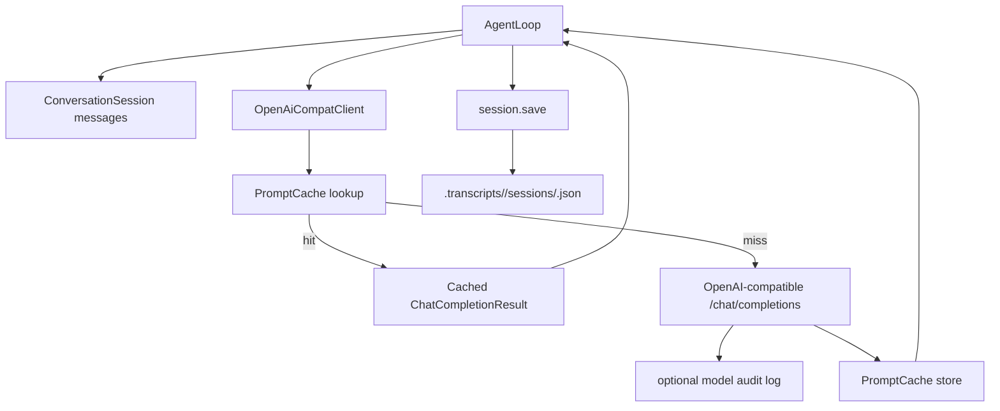

# src/llm

## 中文

`src/llm/` 封装模型调用、会话持久化、prompt cache 和 token 使用统计。它的目标是让上层 runtime 只关心“给定 messages 和工具定义，获得下一条 assistant message”。

### 文件职责

- `openai.rs`：OpenAI-compatible chat completions 客户端，构造请求、调用 HTTP API、写 audit log，并集成本地 prompt cache。
- `session.rs`：`ConversationSession` 与 snapshot JSON 的读写，按 agent kind 和 session id 管理 transcript 文件。
- `cache.rs`：基于请求 hash 的本地 prompt cache，用于复用模型响应。
- `usage.rs`：记录模型返回的 cache hit/miss token，用于输出 prompt cache 命中率。
- `mod.rs`：模块导出。

### 模型调用与持久化流程

### 配置入口

LLM 配置从 `config.rs` 的 `LlmConfig::from_env` 读取，常见环境变量包括：

- `LLM_API_KEY`
- `LLM_BASE_URL`
- `LLM_MODEL`
- `LLM_WRITE_MODEL_AUDIT_LOG`
- `LLM_MODEL_AUDIT_LOG_PATH`
- `LLM_ENABLE_PROMPT_CACHE`
- `LLM_PROMPT_CACHE_DIR`
- `LLM_CONTEXT_COMPACT_ENABLED`
- `LLM_AUTO_COMPACT_TOKEN_THRESHOLD`
- `LLM_AUTO_COMPACT_PRESERVE_RECENT_MESSAGES`
- `LLM_CONTEXT_COMPACT_TRANSCRIPT_DIR`

### 设计要点

- `OpenAiCompatClient` 接收标准 chat messages 和工具定义，返回 assistant message、usage 和 cache 状态。
- session snapshot 保存 `agent_kind`、`session_id`、messages、prompt history、创建和更新时间。
- prompt cache 以规范化 JSON 请求为 hash key，避免同一请求重复调用模型。
- audit log 是调试功能，便于复盘模型请求和响应。
- 上下文压缩配置由 LLM client 暴露给 `runtime.rs` 和 `compact.rs` 使用。

## English

`src/llm/` wraps model calls, conversation persistence, prompt caching, and token usage accounting. Its goal is to let the upper runtime ask: "given messages and tool definitions, return the next assistant message."

### File Responsibilities

- `openai.rs`: OpenAI-compatible chat completions client; builds requests, calls the HTTP API, writes audit logs, and integrates the local prompt cache.
- `session.rs`: reads and writes `ConversationSession` snapshot JSON, keyed by agent kind and session id.
- `cache.rs`: request-hash based local prompt cache for reusing model responses.
- `usage.rs`: tracks cache hit/miss tokens returned by the model and renders cache hit-rate summaries.
- `mod.rs`: module exports.

### Model Call And Persistence Flow

### Configuration Entry Points

LLM configuration is read by `LlmConfig::from_env` in `config.rs`. Common environment variables include:

- `LLM_API_KEY`
- `LLM_BASE_URL`
- `LLM_MODEL`
- `LLM_WRITE_MODEL_AUDIT_LOG`
- `LLM_MODEL_AUDIT_LOG_PATH`
- `LLM_ENABLE_PROMPT_CACHE`
- `LLM_PROMPT_CACHE_DIR`
- `LLM_CONTEXT_COMPACT_ENABLED`
- `LLM_AUTO_COMPACT_TOKEN_THRESHOLD`
- `LLM_AUTO_COMPACT_PRESERVE_RECENT_MESSAGES`
- `LLM_CONTEXT_COMPACT_TRANSCRIPT_DIR`

### Design Notes

- `OpenAiCompatClient` accepts standard chat messages and tool definitions, then returns an assistant message, usage, and cache status.
- A session snapshot stores `agent_kind`, `session_id`, messages, prompt history, created time, and updated time.
- The prompt cache uses a canonical JSON request hash, avoiding repeated model calls for identical requests.
- Audit logs are a debugging feature for reviewing model requests and responses.
- Context compaction settings are exposed by the LLM client for `runtime.rs` and `compact.rs`.
