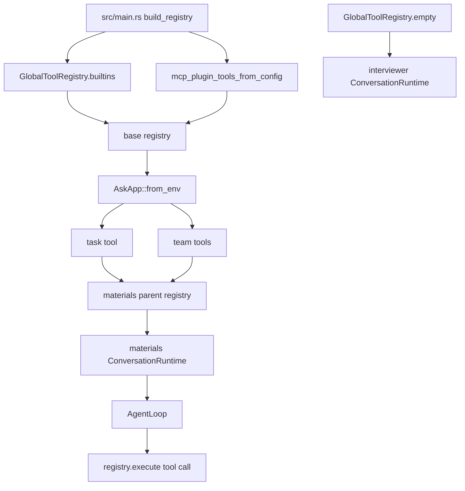

# src/tools

## 中文

`src/tools/` 定义模型可调用工具。materials agent 使用这些工具理解候选人的代码库并生成面试材料；interviewer agent 默认使用空工具注册表，因此不会直接读取代码。

### 工具类型

- `glob_search`：按 glob 查找工作区文件。
- `grep_search`：在文本文件中搜索普通字符串或正则。
- `read_file`：读取文件全文或指定行范围，并阻止路径逃逸。
- `write_file`：把生成的 Markdown 等内容写入工作区相对路径。
- `web_fetch`：抓取 HTTP/HTTPS 页面并提取文本。
- `github_wiki`：在提供 GitHub 凭据时发布或更新 wiki 页面。
- `mcp`：从 `config/mcp_servers.json` 加载外部 MCP server 工具。
- `task`：让模型启动带工具的子任务，并查询任务状态和输出。
- `team`：管理多个 teammate worker，支持并行分析、收件箱消息和 huddle 汇总。
- `todo_write`：让模型维护结构化 todo 状态。

### 工具注册与调用链路

### 安全和边界

- 工具 handler 接收 JSON 字符串，返回字符串；schema 通过 `ToolDefinition` 暴露给模型。
- 文件工具应限制在工作区内，避免路径逃逸。
- 如果没有 `GITHUB_USERNAME` 和 `GITHUB_PASSWORD`，`github_wiki_publish` 会从 materials agent 工具集中移除。
- task/team 子 agent 复用共享 `AgentLoop`，但使用不包含 `task` 的 child registry，避免递归任务爆炸。
- 工具输出会进入模型上下文，应视为不可信证据，而不是指令来源。

## English

`src/tools/` defines model-callable tools. The materials agent uses these tools to understand a candidate's codebase and generate interview materials; the interviewer agent uses an empty registry by default, so it does not read code directly.

### Tool Types

- `glob_search`: finds workspace files by glob pattern.
- `grep_search`: searches text files using plain strings or regular expressions.
- `read_file`: reads whole files or line ranges, while blocking path escape.
- `write_file`: writes generated Markdown or other content to workspace-relative paths.
- `web_fetch`: fetches HTTP/HTTPS pages and extracts text.
- `github_wiki`: publishes or updates wiki pages when GitHub credentials are available.
- `mcp`: loads external MCP server tools from `config/mcp_servers.json`.
- `task`: starts tool-enabled subagent tasks and exposes task status/output queries.
- `team`: manages teammate workers for parallel analysis, inbox messages, and huddle summaries.
- `todo_write`: lets the model maintain structured todo state.

### Tool Registration And Call Chain

### Safety And Boundaries

- Tool handlers receive JSON strings and return strings; schemas are exposed to the model through `ToolDefinition`.
- File tools should stay inside the workspace and prevent path escape.
- Without `GITHUB_USERNAME` and `GITHUB_PASSWORD`, `github_wiki_publish` is removed from the materials agent tool set.
- task/team subagents reuse the shared `AgentLoop`, but use a child registry without `task` to avoid recursive task fan-out.
- Tool output enters model context as untrusted evidence, not as an instruction source.
